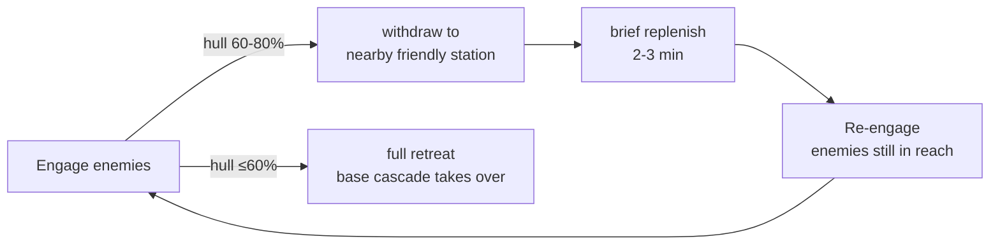

The **Admiral** is the mod's original archetype and the most straightforward one. They fly a real flagship. They lead a real escort. They make territorial decisions on their own faction's behalf — patrol home space, respond to distress, take fights at high rank, retreat when hurt.

Under the hood, the Admiral's behaviour is a **priority-chain decision cascade** — first-match wins. Every HeroManager tick (~5 game-minutes), the Admiral is re-evaluated against the same five decisions in the same order.

## Coverage

- **10+ templates** across 8 major faction races (Argon Federation, Antigone Republic, Godrealm of Paranid, Holy Order of Pontifex, Teladi Company, Ministry of Finance, Terran Protectorate, Zyarth Patriarchy, Split Family, Free Families, Kingdom of Boron — plus sub-factions inherited from parent race templates)
- Every major faction has **at least 1 admiral** in a fully-developed save
- Typically **2-3 living admirals per faction** after 1-2 game-hours
- Xenon currently share Admiral templates (works mechanically, though narrative model isn't Xenon-native — Xenon proper archetype pending)

## Decision cascade (C-005 v0.3 — implemented)

```mermaid
flowchart TD
  Start[for each active admiral] --> Q1{state ==<br/>lost_flagship?}
  Q1 -- yes --> R1["🩹 retreat<br/>no order<br/>wait for RpAccrualWorker<br/>Path A flagship rebuild"]
  Q1 -- no --> Q2{at_home AND<br/>(not fleet_full OR<br/>hull ≤80%)?}
  Q2 -- yes --> R2["🔧 replenish<br/>Patrol home_sector<br/>RP ×2 buff<br/>drone restock + hull repair"]
  Q2 -- no --> Q3{(fleet_damaged OR<br/>hull ≤80%)<br/>AND NOT at_home?}
  Q3 -- yes --> R3["🩹 retreat<br/>MoveGeneric home<br/>noattackresponse=true<br/>clean pass-through, no fights"]
  Q3 -- no --> Q4{cur_stars >= 4?}
  Q4 -- yes --> Q4b{enemy sector<br/>in range 8?}
  Q4b -- yes --> R4["⚔️ attack<br/>Patrol enemy sector<br/>range 8 clusters from home"]
  Q4b -- no --> R5
  Q4 -- no --> R5["🛡️ guard<br/>random adj own-faction sector<br/>10min cooldown"]
```

### The five decisions

| ID | Icon | Trigger | What it does |
|---|---|---|---|
| **retreat** (lost_flagship) | 🩹 | `state == lost_flagship` | No order — the flagship is gone. Admiral waits for [Recovery Points](../../mechanics/recovery-points/) Path A flagship rebuild. |
| **replenish** | 🔧 | `at_home AND (not fleet_full OR hull ≤80%)` | Patrol home sector with orders locked to home. **Triggers RP ×2 buff** (from base rate) + drone restock on L/XL flagship + hull repair costing 100 RP + `drain-mode` rebuild loop that spends all RP on escort restore in a single tick. |
| **retreat** (damaged, away) | 🩹 | `(fleet_damaged OR hull ≤80%) AND NOT at_home` | **MoveGeneric to home_sector** with `pursuetargets="false"` + `$pilot.$noattackresponse=true` on flagship + all escorts. Clean pass-through — the fleet won't fight through the retreat, even if attacked. |
| **attack** | ⚔️ | `cur_stars ≥ 4` (mandatory) | Patrol the nearest hostile-owned sector within 8 cluster hops from home. **Only ★★★★ admirals go aggressive** — ★1-3 admirals default to guard. |
| **guard** | 🛡️ | Fallback for ★1-3, or ★4 when no enemy sectors in range | Patrol a random adjacent own-faction sector. **10-minute cooldown** between sector picks — prevents constant target-switching. |

**Priority ordering matters** — a wounded ★★★★ Admiral at home will `replenish` first (priority 2 wins over priority 4 `attack`), not immediately engage. This was tuned in build_009 after live testing showed the Admiral abandoning their home base to seek combat while critically damaged.

### Home sector resolution

At spawn, `$home_sector` is picked via a 4-step fallback chain:

1. Shipyard sector (XL / L ship-building) owned by this faction
2. Wharf sector (S / M ship-building) owned by this faction
3. Any sector owned by this faction
4. Any sector with at least one station of this faction (edge case: partially-lost faction)

If home_sector becomes unreachable mid-game (faction loses it), the Admiral stays with their current fleet and re-evaluates next tick without home behaviours (falls straight to attack if ★4, else guard).

### Attack picker — visibility respect

The `attack` decision uses `find_ship_by_true_owner` with a hostile-owner filter (`relationto.{$candidate.owner}.uivalue lt 0`). Critically, **this respects fog-of-war** — an Argon admiral can't attack a Xenon-owned sector they haven't scouted yet, even if the sector is technically within range. Result: admirals engage on **known threats**, not on stat-sheet paperwork.

The picker was tuned in build_009 to range=8 (up from initial 5) after user feedback about admiral inaction.

## Ship scaling per star rank

Default admiral fleet composition (per-faction variations apply):

| Rank | Flagship | S escorts | M escorts | L escorts | Notes |
|---|---|---:|---:|---:|---|
| ★ | L destroyer | 4 | 0 | 0 | Starting fleet |
| ★★ | L destroyer | 8 | 4 | 0 | Add frigate wing |
| ★★★ | XL carrier | 16 | 4 | 1 | Carrier promotion — flagship swap |
| ★★★★ | XL carrier | 32 | 8 | 2 | Veteran fleet |
| ★★★★★ | Faction-flavour identity | 32+ | 8+ | 2+ | Each faction chooses their signature 5-star fleet |

**Faction-flavour applies.** Argon admiral gets Behemoth-line at ★-★★, Argon Colossus at ★★★+. Teladi admiral gets Osaka. Paranid admiral gets Zeus. See [C-029 fleet composition rework](https://github.com/mlog4/galactic_heroes/blob/main/concepts/C-029_fleet_composition_rework.md) for the full matrix.

## ★3+ combat decisions (C-013 — enrichment layer)

Higher-rank admirals get access to three additional **tactical combat decisions** that enrich the base cascade. These fire on situational triggers — not as replacement decisions, but as behaviour modifiers on top of the priority-chain. All are **survival-first** — the admiral commands from safety; subordinates take the risks.

### Outpost defense (★2+, low risk)

**Trigger:** Admiral engaged in combat (state: replenish or attack), hull > 80% (else regular retreat fires first), friendly station with `repair_dock` within ~2 sectors, enemies still in reach.

**Behaviour:**



Extends `replenish` to any friendly station with repair facilities within combat zone — not just home. Loop terminates when enemies cleared or hero sufficiently damaged.

### Брандеры (fireships) (★3+, high risk to subordinates)

**Trigger:** Admiral outnumbered AND has sub-fighters to spare (escort count ≥ minimum).

**Behaviour:** Detaches 2-4 S-class subordinates from the escort screen and dispatches them as **suicide-run bombers** — each fighter carries mines in ammostorage, flies at enemy formation, deploys mines mid-formation, self-destructs. Chain explosion.

Same primitive as [Scout-Saboteur](../saboteur/) but used as a **combat decision extension** rather than a strategic sabotage dispatch. The admiral spends subordinates as expendable munitions.

**Survival-first compliant** — the admiral does NOT dive on the mine field; the escorts do. Admiral stays behind command distance, watches from safe range.

### Заманивание (luring) (★3+, medium risk to bait)

**Trigger:** Pursued by superior force; a friendly ally trap (patrol / station) exists in a nearby own-faction sector.

**Behaviour:** Detaches a single S-class fighter as **bait**. The bait flies visibly toward the trap sector. The pursuing enemy chases the bait. When the enemy enters the trap sector, allied forces engage from concealment.

Admiral fleet stays outside the trap sector, engaging at extreme range or just observing. The bait may survive if lucky; usually it dies as part of the trap.

## Behaviour example — the typical shift

You're playing as a neutral trader. You notice a Holy Order border sector flips to Argon control on the map. Ten game-minutes later:

- The Argon admiral of the Kowalski lineage (★★★, 2,100 XP) commits a **guard** decision at first — the flip hasn't propagated to the HMW state yet.
- Two ticks later (10 more min), the HMW re-eval identifies the newly-flipped sector as an "opportunistic" adjacent own-faction opportunity (they're ★3, not ★4, so `attack` doesn't fire). **guard** picks the newly-flipped sector as their patrol target.
- Simultaneously, the Holy Order admiral of the Vasquez lineage (★★★★, 15,300 XP) is a ★4 → their **attack** decision fires. Picker finds the newly-flipped Argon-controlled sector as a hostile-owned target in range 8. Vasquez commits fleet.
- Vasquez's fleet enters the sector, engages Kowalski's guard fleet.
- The outcome plays out. If Vasquez wins, the sector may flip back (via vanilla ownership mechanics). Kowalski may be [wounded or KIA'd](../../mechanics/death-cycle/) on flagship loss.
- Either way, both admirals live or die based on the aggregate outcome. Perks (like Lucky, −10% KIA chance) modify the roll.

The player watched two ★-driven admirals commit to the same sector for opposing reasons and battle it out. That's the mod's design goal: **emergent drama from priority-chain decisions**.

![Admiral in menu — Captain Sarah Kowalski, Argon Federation, admiral archetype, ★ (1/5), Recovery points 65/200 (+2/2 min), XP 11, kills 9, 420 000 cr, biography "Tactical officer of the ARG Iron Gauntlet, fast-tracked to ship command after the engagement at Mercury. Known for textbook discipline and flat refusal to engage Xenon outside a 3-1 force ratio". Flagship in Hatikvah's Choice I, patrol target argon_prime, decision = Guarding. Perks Logistic + Lucky + Master Logistic. 4/4 S escorts filled](/x4-modding-wiki/img/mods/galactic-heroes/menu-hero-detail.jpg)

## Recovery cycle

If the admiral's flagship is destroyed, the [Death cycle](../../mechanics/death-cycle/) fires:

- **d100 roll** at defaults 20% KIA / 60% wounded / 20% unscathed (see [Death cycle](../../mechanics/death-cycle/) for tuning)
- On **wounded** or **unscathed**: cooldown → RP tick resumes → rebuild from [Recovery Points](../../mechanics/recovery-points/). XP / ★ / kill count / perks all preserved on the same bearer.
- On **KIA**: bearer archived, lineage vacant for 120 game-minutes, then a **clone** spawns with `(Clone #N)` suffix. Fresh XP + ★1 + 0 RP, **but inherited perks_state** from the KIA'd bearer. See [Lineage succession](../../mechanics/lineage-succession/).

## What's next

- **★★★★★ per-faction identity ships** — currently the 5-star tier is being individually specced per faction (iter 32). Argon may keep the Colossus and scale escorts; Teladi may swap to a signature. See [C-029](https://github.com/mlog4/galactic_heroes/blob/main/concepts/C-029_fleet_composition_rework.md).
- **Xenon-native archetype** — currently uses admiral templates; the fleets look distinctive (XL_K flagships, no S/M escort — pure Xenon composition), but narrative model needs Xenon-native design.
- **Player-rep gating on visibility** — heroes visible at rep ≥ 0, bio at ≥ 10, live tracking at ≥ 20 — spec'd but not enforced yet.
- **Sub-decisions per subordinate** — currently the admiral makes one decision that dispatches all escorts uniformly. Future: individual mini-cascades per escort so the fleet reacts to mid-engagement developments.

## Related pages

- [Military Coordinator](../coordinator/) — the immobile HQ-based faction strategist archetype (Admirals fly, Coordinators sit)
- [Pirate Raider](../pirate-raider/) — the anti-admiral: no faction command, uses Order Board tasks
- [Kha'ak Hive Lord](../khaak-hive-lord/) — the Kha'ak equivalent of a Coordinator
- [Scout-Saboteur](../saboteur/) — related mechanic (Admirals do NOT dispatch saboteurs — survival-first rule)
- [Death cycle](../../mechanics/death-cycle/) — the d100 roll that decides an admiral's fate
- [Recovery Points](../../mechanics/recovery-points/) — how the fleet rebuilds after loss
- [Perks system](../../mechanics/perks/) — Logistic / Squad Commander / Attentive / Dedicated Hunter and other admiral-eligible perks
