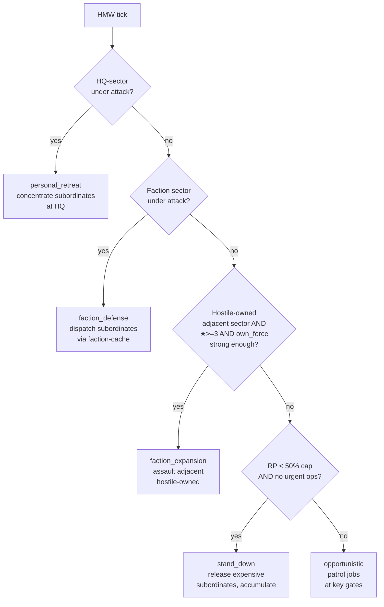

The problem the Coordinator solves: **vanilla faction defence is chaotic**. Faction patrols react to distress signals via the PCS (Patrol Craft System) logic, but that reaction is loose. You see a lone Argon patrol lose to a Xenon K in a border sector while three other Argon patrols burn cycles two clusters over. There's no strategic hand.

The Military Coordinator is that hand. They sit in the capital, **commandeer scattered faction military ships**, and dispatch them as coordinated operations. Argon becomes "Argon with a war room". You watch the difference on the strategy map.

## Coverage

- **10+ templates** across the "large faction" set: Argon Federation, Antigone Republic, Godrealm of Paranid, Holy Order, Teladi Company, Ministry of Finance, Hatikvah Free League, Split Family, Free Families, Zyarth Patriarchy, Terran Protectorate, Boron Kingdom
- **Only 1 Coordinator per faction** — they are the singular strategist. Alternative "multiple coordinators for territorially-split factions" is on the future-work list.
- **Small factions don't get one.** Eligibility: ≥3 owned sectors + at least one shipyard. Naturally excludes Pioneers, small Hatikvah, small Holy Order.
- **Xenon and Kha'ak don't get one** — they have their own archetypes ([Hive Lord](../khaak-hive-lord/) for Kha'ak; Xenon proper archetype pending).

## Playstyle — the war room

Coordinators are **immobile**. They sit on a fixed HQ station in the faction's capital sector. No flagship-swap, no fleet-of-their-own.

Instead, they hold a roster of **commandeered subordinates** — faction military ships pulled off their patrol jobs and reassigned to a coordinated operation. The commandeer is done via vanilla `commandeer_object` + `release_commandeered_object` primitives (see [R-013 in the repo](https://github.com/mlog4/galactic_heroes/blob/main/research/R-013_commandeer_remote_command.md)). Cross-sector orders are instant (vanilla behaviour).

Result: while the vanilla PCS moves ships to distress signals in ~30-60 sec, the Coordinator can execute a coordinated multi-sector move in seconds.

## Command capacity per star rank

| ★ | Max subordinates | RP tick baseline |
|---|---|---|
| ★ | **5 ships** | 5 |
| ★★ | **10 ships** | 6 |
| ★★★ | **20 ships** | 8 |
| ★★★★ | **30 ships** | 10 |

Higher star = wider strategic reach + more ops budget per tick.

**Subordinate composition** is what the faction has jobs for — S fighter jobs, M frigate jobs, L destroyer jobs. The Coordinator doesn't buy ships; they **borrow** from the job pool and return them when the op completes.

## Decision cascade (mission-first, first-match wins)

| Priority | Decision | Effect |
|---|---|---|
| 1 | **personal_retreat** | HQ-sector is threatened → recall all subordinates to HQ for concentrated defence. Overrides everything else — if HQ falls, the Coordinator disbands. |
| 2 | **faction_defense** | Any own-faction sector under distress → dispatch subordinates from the faction cache to the threatened sector. Coordinated response instead of PCS random-timing. |
| 3 | **faction_expansion** (★≥3) | An adjacent hostile-owned sector exists AND the Coordinator's aggregate subordinate force is strong enough → assault it. Only ★★★+ Coordinators are aggressive; ★-★★ defensive-only. |
| 4 | **stand_down** | RP is below 50% cap AND no urgent ops → release expensive subordinates back to job pool, accumulate RP for the next big op. |
| 5 | **opportunistic** | Fallback → hold subordinates on patrol at key gates in own-faction space. |

Unlike Admirals (who have `at_home`/`fleet_full` triggers), Coordinators don't have "idle patrol at home" — they always have a target (a threat to respond to, a gate to hold, an accumulation to bank).

## RP economics

- **RP tick** scales with rank (5-10 RP per tick per rank).
- **RP spent** on ops: commandeer a subordinate (~ship-class-cost RP), issue special ops (saboteur dispatch ~30 RP, defensive minefield ~50 RP, etc.).
- **Cap 200 RP** — same as other archetypes.
- **RP does not tick during** personal_retreat / KIA cooldown.

Coordinator RP is spent **on actions**, not on rebuild. Admirals restore lost escorts from RP; Coordinators don't own their subordinates, so lost subordinates return to the job pool for the faction to rebuild via vanilla mechanics.

## Special ops available

Coordinators have access to **Scout-Saboteur dispatch** — see [Saboteur mechanic](../saboteur/). Cost ~30 RP per dispatch; unlocks at ★2.

At ★3+ they can dispatch **coordinated mine walls** (multiple saboteurs deploying mines at strategic gates simultaneously) — same primitive, multi-target orchestration.

At ★4 they get **fire ship** brigade dispatch — dispatch several S-class subordinates as suicide-run bombers into a Xenon defence grid, in a wave pattern. Not available to Admirals (survival-first rule); the Coordinator is comfortable spending subordinate lives on tactical wins.

## Behaviour example — Kha'ak invasion of Argon border

Kha'ak Seeder drops a new hive in Argon-adjacent Silent Witness III. Argon Coordinator (Colonel Vasquez lineage, ★★★, 4,200 XP) is in Argon Prime.

- HeroManager tick: Argon HQ sector Argon Prime is not under attack. Silent Witness III is Argon-controlled and is under attack (Kha'ak activity). **faction_defense** fires.
- Vasquez's cache lookup identifies 8 patrol jobs currently in Argon-space: 4 Cerberus M patrols, 2 Behemoth L patrols, 2 Katana XL patrols.
- Commandeers 12 subordinates from the top of the cache (capacity ≥ 20 at ★★★, well within budget). Cost: ~120 RP.
- Dispatches: L destroyers direct-attack the new hive, M frigates form a screen at the Silent Witness III gate to block Kha'ak reinforcement. XL Katana in reserve at Argon Prime gate.
- Kha'ak hive falls in 15 minutes. Vasquez releases subordinates back to the job pool. Cost: ~120 RP spent, 200 XP earned (12 subordinate kills × 25 for L-class + hive itself).
- Next tick: HQ safe, no active threats. Falls back to **opportunistic** — subordinates patrol Argon Prime + Second Contact gates.

The player watched Argon coordinate a fast, disciplined defence — very different from vanilla PCS's ~60-90 sec drift-response.

_Note: the screenshot shows Tarkanius idle (0/2 fleets deployed) — that's a Coordinator in an accumulate/opportunistic state between engagements. The **HQ sector** field shows the immobile base of operations. Fleet is empty because subordinates are on their own patrol jobs when not tasked._

## Death of a Coordinator → cascade release

When a Coordinator's HQ station is destroyed (or the Coordinator is KIA'd), the mod does an **explicit cascade release** of all commandeered subordinates. This is a departure from vanilla PCS behaviour — vanilla PCS leaves subordinates in an orphan state on their commander's death. Galactic Heroes releases them cleanly back to the faction's job pool so they resume normal patrols.

Then the standard [d100 death roll](../../mechanics/death-cycle/) fires. On KIA, the lineage enters vacancy for 120 game-minutes; on wounded/unscathed, the Coordinator recovers with fresh subordinates (they don't have a "flagship" to rebuild — recovery just means their RP starts ticking again after the cooldown).

## Coverage — who has a Coordinator right now

Active in a healthy save (per the "Active heroes by faction" screenshot in the overview):
- Argon Federation: 3 heroes (2 admirals + 0 coordinators depending on faction state; the coordinator slot is optional if the admiral count is high enough)
- Godrealm of Paranid: 3 heroes including High Strategos Tarkanius (coordinator ★★)
- Zyarth Patriarchy: 3 heroes including Warmaster Warmaster Tahl (coordinator ★★)
- Quettanauts: 2 heroes including Resonant Voice Harmel (coordinator ★★ 214 XP)

**Not every large faction has a Coordinator alive at all times** — spawn is subject to available templates + HeroManager slot budget. On a fresh save, expect the first Coordinator to appear within ~15-30 game-minutes.

## What's next

- **Coordinator visualisation** — currently the subordinate roster + assigned positions are visible only in the hero detail page. A future overlay may show the Coordinator's active dispatch on the map.
- **Per-subordinate mini-cascade** — currently the Coordinator makes one decision that dispatches all subordinates uniformly. Future: individual subordinate decisions (engage / hold / retreat) at the subordinate level, so a coordinated op can react to mid-engagement developments.
- **Multi-Coordinator per faction** — currently only 1 per faction. Territorially-split large factions (Argon holds Argon Prime + Second Contact + Getsu Fune corridors) could logically have 2-3 regional coordinators. Future work.

## Related pages

- [Admiral archetype](../admiral/) — the parallel, mobile-based archetype (Admirals fly, Coordinators sit)
- [Kha'ak Hive Lord](../khaak-hive-lord/) — the Kha'ak analog of a Coordinator, capacity 8/15/25/40 (higher because Kha'ak fighters individually weaker)
- [Scout-Saboteur](../saboteur/) — a special-ops primitive the Coordinator can dispatch
- [Faction Missions](../../mechanics/faction-missions/) — the Reserve Shipyard mission is what lets a player raise the Coordinator's faction hero cap by +1
