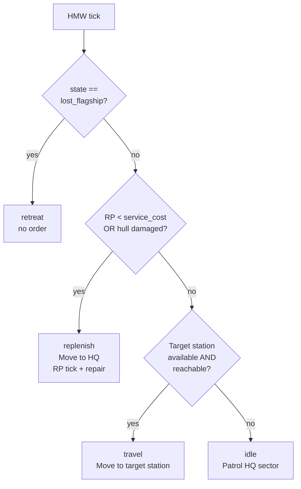

Not every hero is a killer. The **Engineer** is a non-combat archetype whose whole job is **improving faction economy**. Their primary loop is not sector-patrol-and-fight but **travel-to-station / apply-buff / move-on**.

Mechanically, the Engineer is a **modifier of external state** — they don't shoot things; they change how much production a friendly station outputs per hour. It's the mod's first non-combat gameplay loop, and it turns out to be one of the mod's cleanest interactions with vanilla X4's economy.

## Coverage

- **6 templates** across the "production-heavy faction" set: Argon, Paranid, Teladi, Split, Terran, Boron
- Also spawnable for their sub-factions (Antigone, Holy Order, Hatikvah, Ministry, Free Split, Kaori — with sub-faction identity inherited from parent-race template)
- **Not for pirates / Xenon / Kha'ak** — they don't have a production network to service. Also not for coordinators-only factions (small).
- Engineer slot is separate from admiral slot. Formula: `engineer_slots = 1 + floor(stations_owned / 5)`, capped at 10 per faction.

## Playstyle — the travelling mechanic

Engineers are **mobile but non-combat**. Their flagship is an **M-class miner ship** (visually the mining rig loadout — mining tools protruding, a working, industrial silhouette). Very small S-fighter escort (0-4 depending on rank, self-defence only).

They fly:
- From station to station within their own faction's territory only (never through hostile / neutral space)
- To the **highest-production own-faction station that isn't currently buffed and isn't claimed by another engineer**
- Apply a temporary production efficiency buff, then move to the next target
- Return to HQ for RP replenishment when they run low

They never engage in combat willingly. If attacked, they route through the retreat cascade — MoveGeneric back to a safe own-faction sector, resume ops after cooldown.

## Fleet composition per star rank

Engineers do **not swap flagships across star ranks**. The M miner is their identity.

| ★ | Flagship | Escort |
|---|---|---|
| ★ | M miner (race-specific) | 0× S fighters |
| ★★ | M miner | 1× S fighter |
| ★★★ | M miner | 2× S fighters |
| ★★★★ | M miner | 4× S fighters |

The escort is purely for personal defence during travel. Engineers are visibly not warfleets — a Teladi player will see the Engineer's Teladi mining rig outfit + a Teladi fighter pair, and know at a glance "that's the engineer, not a war party".

## Decision cascade

Engineer decision loop is simpler than admiral / coordinator — four decisions in priority order:

| Priority | Decision | Effect |
|---|---|---|
| 1 | **lost_flagship / retreat** | Rebuild via [Recovery Points](../../mechanics/recovery-points/), same as other archetypes |
| 2 | **replenish** | Return to HQ station when RP insufficient for another service action, or when hull damaged. RP tick continues; hull repairs via 100 RP if damaged |
| 3 | **travel** (`Move to station`) | Fly to the picked target station (highest-production, own-faction, not yet buffed, not claimed by another engineer) |
| 4 | **idle** (`Patrol HQ`) | Fallback when no eligible target — patrol home sector waiting for a new station to become available |

Also implicitly: **service_station** action fires at target arrival (not a separate decision — it's the action executed on arrival).

## The buff — how it actually works

X4 9.x doesn't expose a writable "production efficiency" property. So the Engineer's buff is simulated:

- On service, the mod sets `$module_buff_active = true` on the target station's registry entry, records `$buff_pct` (based on Engineer's ★) and `$buff_until` (based on ★-duration table)
- Every 15 game-minutes, a global worker iterates buffed stations. For each buffed module producing output:
  - Reads the module's expected vanilla `production_rate` (from module recipe × current inputs)
  - Calls `add_wares` to inject `production_rate × buff_pct × interval` additional output into the station's cargo
- Inputs are NOT deducted — the semantic is "the engineer makes inputs go further"

**No API for cross-faction:** Engineers only buff **own-faction stations**. A Teladi engineer never buffs an Argon station.

## Buff tiers per star rank

| ★ | Buff pct | Duration | Feel |
|---|---|---|---|
| ★ | +20% efficiency | 6 game-hours | Gentle steady bump |
| ★★ | +30% | 9 hours | Noticeable difference |
| ★★★ | +50% | 12 hours | Impactful — a hero engineer's stations pump |
| ★★★★ | +80% | 24 hours | Endgame — Teladi Ministry with two ★★★★ engineers has 20-40% of their production silently overclocked |

**Service cost:** 100 RP per action. Per-engineer cooldown: 60 game-minutes (can't spam a single hero across multiple stations back-to-back).

## Station claiming (multi-engineer race resolution)

If a faction has multiple Engineers (large factions with big station networks), they race to claim targets:

- Each station has `$mlog_eng_claim_by` (which engineer claimed it) + `$mlog_eng_claim_until` (30 min expiry) fields
- When an Engineer picks a target station via HeroManager, they atomically write the claim
- Other Engineers filter out claimed stations from their picker
- On service action or claim expiry (30 min), the claim clears
- On arrival, the Engineer checks the claim is still theirs — if another engineer beat them there and already buffed, the race is lost and the Engineer goes back to `idle`

Result: multi-engineer factions naturally spread across station networks without conflict.

## Stacking rules

- **Engineer buffs do NOT stack with each other.** Buffed stations are excluded from the picker. If Argon has two ★★★ engineers, they buff two different stations; never the same one.
- **Engineer buffs DO stack with:**
  - Vanilla workforce production bonus
  - DA-Eco DA Wares boosts (if DA-Eco is installed — but Heroes doesn't require it)
  - Any other vanilla buff
- Result: a station being both workforce-buffed AND Engineer-buffed produces `base × (1 + workforce_bonus) × (1 + engineer_pct)` — multiplicative stacking with vanilla systems.

## XP economy

Engineers gain XP differently from combat archetypes. Their XP source:

- **+1 XP per production module of the buffed station**, credited on the service action

Practical numbers: a mid-tier Teladi production station has ~6 production modules → +6 XP per service. At 1 service per 60 min, that's ~6 XP/hour. To reach ★★★ (1000 XP), an Engineer needs ~166 hours of active service — very slow, realistic-feeling career.

No combat XP source (Engineers never kill anything).

## Behaviour example — a Teladi Engineer

Daria Sokolova, Chief Engineer of Argon Federation industrial corridor. ★★, 200 XP, 210,000 cr in the wallet.

- HeroManager tick: her flagship is docked at Argon Prime shipyard (HQ). RP = 3/200, and the last service was 40 min ago — not enough RP yet for the next 100 RP action.
- Decision: **replenish** — she stays at HQ, RP tick continues. Next tick, RP is 65/200, still not enough.
- 30 min later, RP hits 100. Decision: **travel** — the picker finds "The Reach" sector, ARG Plasma Conductor Factory I. Not yet buffed, not claimed. Distance: 4 gate hops all through Argon-owned space.
- She undocks, flies to The Reach, docks at the plasma conductor factory.
- **Service action:** applies +24% efficiency buff (30% base for ★★, but her Master Technician perk is +20% relative → 30% × 1.2 = 36%… actually 30% + 20% relative = 36%, though the exact math depends on stacking) for 9 game-hours. RP -100. XP +11 (station has 11 production modules).
- She waits at the plasma conductor factory until the service cooldown wears off (30 min with Efficient Service perk, else 60 min).
- Next HeroManager tick: replenish → back to Argon Prime, or if RP not too low, immediately travel to the next-highest priority station.
- Over 9 game-hours, the ARG plasma conductor factory produces ~24% more plasma conductors than baseline. Argon shipbuilding gets faster. The player never sees this in a notification; they see it in stronger Argon fleets 10 hours later.

![Chief Engineer Daria Sokolova — Argon Federation, engineer archetype, ★★★★ ★★ (2/5), 11 XP, 0 kills, 210 000 cr, biography "Coordinates production efficiency across the Argon Federation industrial corridor". Flagship "Flagship of Daria Sokolova" M destroyer in The Reach sector, service target ARG Plasma Conductor Factory I, decision = Travelling to station. Perks Master Technician + Quartermaster + Second in Line. Engineering panel shows service cooldown 58.9963 min remaining, stations buffed lifetime = 1, modules buffed = 11, active buffs on ARG Medical Supply Factory I / The Reach: +24% for 358.996 min, 11 modules × 54912 m^3/h = 3 733 200 cr value injected](/x4-modding-wiki/img/mods/galactic-heroes/hero-engineer.jpg)

## Death of an Engineer

Engineers can be KIA'd like any archetype. Same [d100 roll](../../mechanics/death-cycle/) on flagship destruction: 20% KIA / 60% wounded / 20% unscathed at defaults.

**Active buffs survive the Engineer's death.** A station buffed 4 hours ago continues to receive `add_wares` for the remaining 5+ hours regardless of who buffed it. The buff is on the station, not on the Engineer.

On KIA, standard lineage vacancy (120 game-minutes) → new [clone](../../mechanics/lineage-succession/) spawns with the Engineer's inherited perks.

## What's next

- **Engineer visualization overlay** — currently the buffed stations + active buff timers are visible only in the Engineer's detail page. A future overlay may show the whole faction's buffed-station map.
- **Cross-service** — Engineers currently only buff production stations. Future: buff shipyards (build speed +X%), buff wharves (equipment stock +Y%), buff trading stations (ware turnover +Z%). Cargo-injection extends naturally.
- **Enemy sabotage** _(concept)_ — a "reverse engineer" could apply negative production buffs to enemy stations. Different archetype, same primitive.

## Related pages

- [Admiral archetype](../admiral/) — the combat-focused mobile archetype
- [Coordinator archetype](../coordinator/) — the immobile HQ-based archetype
- [Perks system](../../mechanics/perks/) — Master Technician (+20% buff potency), Long Lasting Buff (+50% duration), Efficient Service (30 min cooldown), Reduced Cost (50 RP service) are the engineer-specific perks
