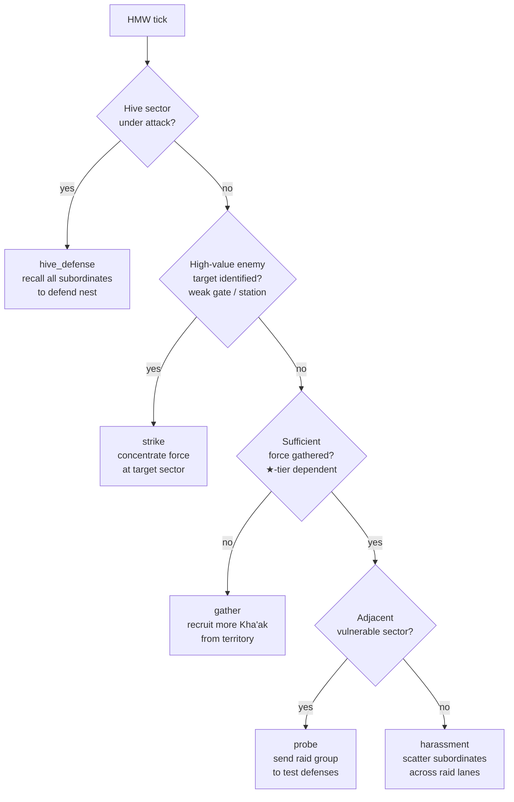

Vanilla Kha'ak are **trickle annoyance** — random raids, no concentration, easy to counter once you've fielded a decent patrol. The **Kha'ak Hive Lord** turns them into a **deliberate menace**. Under a Hive Lord, scattered Kha'ak fighters aggregate into coordinated strikes on high-value enemy targets. When you see Kha'ak going after your Argon shipyard specifically (instead of random freighters), you know one is alive.

The Hive Lord is the [Military Coordinator](../coordinator/) equivalent for Kha'ak — same commandeer-and-command primitive, but **offensive-first** instead of defensive-first. Kha'ak don't defend; they expand and strike.

## Coverage

- **1 template** — Khaak faction only
- Not more than 1 Hive Lord active at any time
- **Spawn eligibility:** Kha'ak has ≥1 hive structure OR ≥1 Kha'ak-owned sector in the galaxy
- **Disband condition:** all Kha'ak hives destroyed → cascade release all subordinates → Hive Lord disbands
- Available Kha'ak forces: **not commandeered from vanilla jobs** — Kha'ak have their own spawn pattern that scatters fighters across the galaxy. Hive Lord **collects** those wandering fighters.

## Playstyle — the psychic matriarch

Hive Lord is a **hive consciousness shard** — a distributed psychic presence that exists in multiple Kha'ak nests simultaneously. Not an individual being in the physical plane. Immobile in primary nest, controls all Kha'ak in galaxy through psychic command.

- **No flagship-swap, no fleet-of-their-own** — same as Coordinator
- **Collects wandering Kha'ak fighters** — no job structure, just aggregation of what's already in-galaxy
- **Cross-sector orders are instant** — same primitive as Coordinator
- **Offensive-first priority** — the mod's ONLY archetype with offense as priority 2 (Coordinator has defence). Kha'ak don't do garrison duty.

## Command capacity per star rank

**Higher than Coordinator** — Kha'ak fighters are individually weaker than human military, so it takes more of them to project real force:

| ★ | Max subordinates | RP tick baseline | Comparable Kha'ak force |
|---|---|---|---|
| ★ | **8 ships** | 5 | Small raid group |
| ★★ | **15 ships** | 6 | Sector incursion |
| ★★★ | **25 ships** | 8 | Multi-sector campaign |
| ★★★★ | **40 ships** | 10 | Mass strike — serious threat for 1-2 sectors |

At ★★★★, a Hive Lord can concentrate 40 Kha'ak fighters + a few M-frigate escort on a single target. That's a real invasion. Without a Hive Lord, those 40 fighters would be spread across 8 sectors doing random flybys.

## Decision cascade (offensive-first, first-match wins)

| Priority | Decision | Effect |
|---|---|---|
| 1 | **hive_defense** | Any hive sector under attack → recall all subordinates to defend the threatened nest. Overrides everything else — if all hives die, the Hive Lord disbands. |
| 2 | **strike** | Enemy has identified a **high-value vulnerable target** (weak gate, undefended station, isolated shipyard). Concentrate maximum force at that sector. |
| 3 | **gather** | Force insufficient for a major strike (per ★-tier requirement) → recruit more Kha'ak fighters from own territory or nearby sectors. Wait for critical mass. |
| 4 | **probe** | Test enemy defences with a smaller raid group in an adjacent vulnerable sector. Learn where the soft spots are; escalate later. |
| 5 | **harassment** | Fallback → scatter subordinates across raid lanes for opportunistic attacks. This is what vanilla Kha'ak do — the Hive Lord falls back to this when other decisions don't fit. |

**Unlike Admirals or Coordinators, there is no "idle patrol" for Hive Lord** — they always have a target. Kha'ak don't do peace.

## Strategic targeting — "smart Kha'ak"

The `strike` decision uses a **target scoring** algorithm that goes beyond "closest enemy sector":

- **Player shipyard / wharf** — high value
- **Faction shipyard / wharf** — medium-high value
- **Trade waypoint** — medium
- **Isolated station** — medium (easy kill)
- **Well-defended sector** — low (avoid)

Result: a ★★★★ Hive Lord will **repeatedly strike Argon Prime shipyard's outer perimeter** instead of random Argon freighters. Player learns to reinforce specific targets. The Hive Lord learns to switch targets after a few losses.

This is what changes Kha'ak from "background noise" to "hostile intelligence".

## No player-vs-Kha'ak Order Board interaction

The Kha'ak Order Board has its own order types:

- **$hive_development** — build up hive infrastructure (grows over time)
- **$swarm_summon** — spawn additional Kha'ak fighters at random hive location
- **$small_resonance** — psychic communication event (network coherence, small)
- **$big_resonance** — psychic communication event (large; scales power output)
- **$system_resonance** — network-wide psychic ceremony (biggest tier)
- **$call_for_help** — request Kha'ak reinforcement in a threatened sector
- **$fleet_defense** — coordinated defence around a specific hive

Players don't interact with these — they're Kha'ak-internal state. The Hive Lord processes them via their normal HMW cycle, generating threat activity as a side-effect. See screenshot below.

## Kha'ak "recruitment" mechanic

The Hive Lord's `gather` decision uses **local Kha'ak scan** to find wandering fighters:

- Every HMW tick, the Hive Lord runs a galaxy-wide scan for Kha'ak ships without an active commander
- Those ships are **added to the Hive Lord's subordinate list** at no RP cost (they weren't earning anyone else RP anyway)
- Subordinate list is capped at rank capacity (8 / 15 / 25 / 40)
- Excess fighters remain wild (vanilla behaviour)

This is **NOT commandeering** in the vanilla PCS sense — Kha'ak don't have a job system. The mod simulates aggregation via ownership swap in the mod's subordinate registry.

## Behaviour example — a ★★★ Hive Lord strike

Manifold-of-Spires (★★, 278 XP, 72 kills) — Kha'ak Hive Lord.

- HMW tick: Kha'ak hive in Mists of Artemis is fine. No hive under attack. **hive_defense** doesn't fire.
- Target scoring: Argon Prime shipyard identified as a high-value target (weak defensive posture). **strike** fires.
- Subordinate list: 15 Kha'ak fighters (at ★★ capacity), scattered across Mists of Artemis, Pious Mists IV, Sanctuary of Darkness.
- Manifold recalls all to Pious Mists IV (staging point).
- Once concentrated: fleet moves through Sanctuary of Darkness → Argon Prime.
- Encounter Argon patrols. Fight through some, arrive at Argon Prime shipyard's outer perimeter.
- Engage Argon defensive fleet. Kha'ak lose ~5-8 fighters; Argon loses ~3-4 M/S. Net win for Argon locally, but the Argon reinforcement fleet is now committed here — the shipyard is under real attack.
- If Manifold survives, retreat to Pious Mists IV with what's left, take on `gather` decision next tick.
- If Manifold's flagship (their Kha'ak Queen equivalent) dies → [d100 death roll](../../mechanics/death-cycle/).

## Recovery cycle

Same d100 death roll on Hive Lord's HQ nest destruction (or on Hive Lord's own flagship, whichever comes first mechanically). Default 20% KIA / 60% wounded / 20% unscathed.

**On death** — cascade release ALL subordinates back to vanilla Kha'ak random behaviour. The player sees the difference: what was concentrated menace becomes back-to-normal Kha'ak scatter. This is a **positive UX signal** — players know when they've killed the Hive Lord because the map noise changes.

On KIA, standard lineage vacancy (120 game-minutes) → next clone spawns with the previous bearer's perks state. Kha'ak-specific perks include Khaak Seed (+1 RP per Kha'ak ship lost, +5 per outpost, +10 per hive) — meaningful because the Kha'ak faction *does* lose ships regularly, so the Hive Lord accumulates RP from the ongoing attrition.

## Relationship to Kha'ak Seeder

Hive Lords are **reactive commanders** — defence + counter-strike. **Seeders** are **proactive builders** — new hives, new outposts. Together they form a **self-propagating Kha'ak threat**:

1. Seeder scans galaxy for undefended border sectors adjacent to Kha'ak space
2. Seeder drops a new hive (via spawn action; see [Seeder cascade](../khaak-seeder/))
3. Nearby Hive Lord (if any) picks up the new hive in their territory scan and starts including it in `hive_defense` rotation
4. If the player / another faction attacks the new hive, Hive Lord commits force to defend it or counter-attack the aggressor's forces
5. If the aggressor gives up, Seeder finds another target

Clearing one Kha'ak sector doesn't stop the Kha'ak. The Seeder will eventually find another vulnerable position. Over enough time, unattended Kha'ak factions spread. Player is under low but constant pressure.

## Design intent

- **Kha'ak feel like a persistent, adaptive threat** — not a static garrison to be cleared once and forgotten.
- **Player has agency to remove the Hive Lord** — killing them turns Kha'ak back into vanilla noise. A Kha'ak-clearing playthrough has a boss-level target: kill the Hive Lord, watch the Kha'ak activity fall off.
- **No PCS integration** — Kha'ak are their own thing. The Hive Lord uses Kha'ak-native primitives instead of trying to force-fit them into human faction command structures.

## What's next

- **Kha'ak-flavoured decision UI** — currently the Hive Lord surfaces in the same menu as human archetypes. Planned: distinct "warfront overview" showing hive clusters instead of individual heroes.
- **Sector-level Kha'ak coordination** — currently the Hive Lord coordinates loosely. Planned: per-cluster "warfront ledger" so the Hive Lord's own state is more structured.
- **Boss-tier Kha'ak Hive Lord** — future concept: named ★★★★★ Hive Lord for endgame content, requiring player-scale coordination to take down.
- **Multi-Hive Lord** — currently 1 per Kha'ak. Very long saves could see 2-3 regional Hive Lords for territorially-split Kha'ak. Future work.

## Related pages

- [Kha'ak Seeder archetype](../khaak-seeder/) — the proactive builder counterpart
- [Military Coordinator](../coordinator/) — the human-faction analog (defensive-first vs offensive-first)
- [Scout-Saboteur](../saboteur/) — Kha'ak-native user of the saboteur primitive; fits swarm-suicide aesthetic
- [Death cycle](../../mechanics/death-cycle/) — the d100 roll for Hive Lord destruction
- [Perks system](../../mechanics/perks/) — Khaak Seed / Prepared / Volunteer / Legendary Veteran and other Kha'ak-appropriate perks
