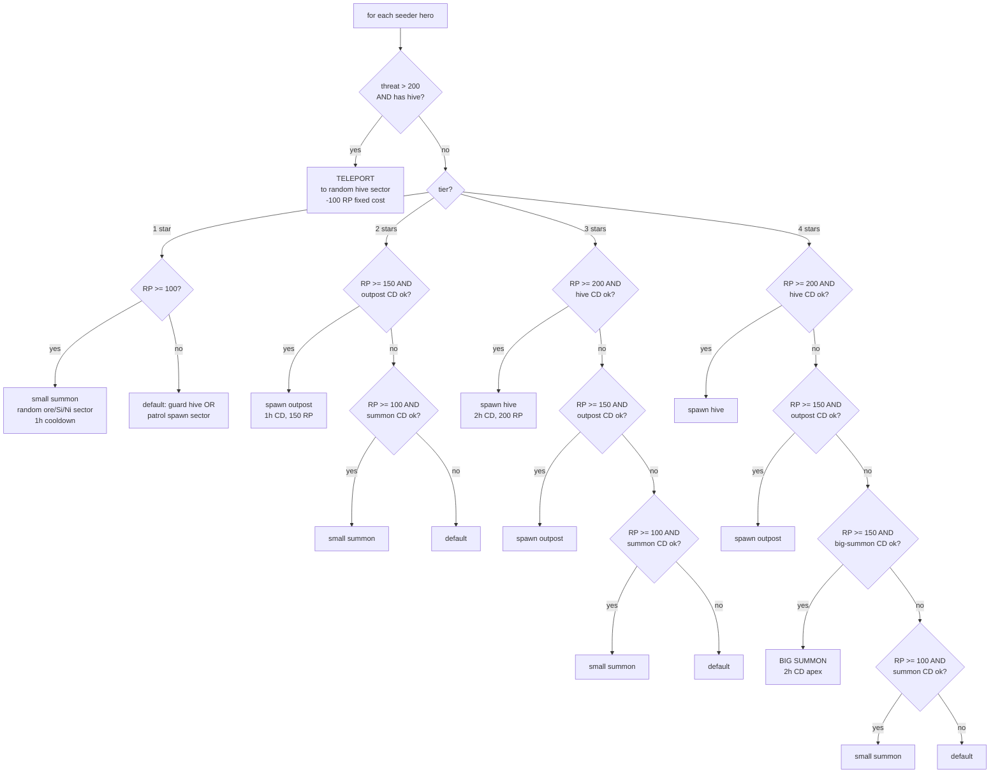

The **Seeder** is the mod's most-different archetype. Not flagship-centric like Admiral / Pirate. Not immobile like Coordinator / Engineer. Instead, the Seeder's identity is **the network they grow** — hives, outposts, spawning locations. The flagship is a delivery vehicle, not the archetype's core.

The Seeder is Kha'ak's **build-out** counterpart to the [Hive Lord's](../khaak-hive-lord/) **strategic command**. Together they self-propagate Kha'ak presence: Seeder drops new hive → Hive Lord defends it → both together drive the threat forward.

## Coverage

- **1 template** — Khaak faction only
- **Dynamic quota:** `max_seeders = 1 + floor(hive_count / 10)`. A galaxy with only Kha'ak home hives → 1 Seeder. A galaxy where Kha'ak have spread to 30+ hives → 3+ Seeders. **Self-scaling**.
- Slow-burn: 10 hives × 2h Big Summon cooldown = dozens of hours real-time before the 2nd Seeder ever spawns
- Not disband on hive loss — Seeder is loosely coupled to network. Loss of one hive doesn't kill Seeder; Seeder death doesn't kill hives

## Playstyle — the gardener

Seeder is a **Brood-Mother** / **Gardener of Hives**. Not a warrior, not a defender. They:

- Fly around the galaxy looking for mineral-rich sectors (ore, silicon, ice, nividium)
- Drop **outposts** (small structures, defensive purpose)
- Drop **hives** (large structures, spawning purpose)
- **Summon** Kha'ak fighters from own network — the more hives + outposts the network has, the more units each summon produces
- **Teleport to safety** when threatened — no combat, ever

Unlike other archetypes, Seeder is **hostile to everyone** (vanilla Kha'ak relations). Even other Kha'ak factions if any exist. Pure isolationist expansion.

## Fleet composition — small, light, escape-oriented

The Seeder flagship stays **M Kha'ak throughout all ranks** — no flagship swap. Small escort screen grows:

| ★ | Flagship | Escort |
|---|---|---|
| ★ | M Kha'ak flagship | 0 |
| ★★ | M Kha'ak flagship | 2× S |
| ★★★ | M Kha'ak flagship | 2× M + 4× S |
| ★★★★ | M Kha'ak flagship | 4× M + 8× S |

Not enough fleet to hold ground against major forces. Speed + teleport make up for it. Fleet is there to **survive travel** to unclaimed sectors + defend during 10-min hive drop windows.

## Decision cascade — tier-priority

The Seeder cascade is **tier-aware** — different star ranks have different priority chains. Rule 0 always applies regardless of tier.



**Key principle:** on each ★, Seeder **first builds infrastructure** (improving formula buff for future summons), **then spends RP on spam**. This automatically creates a network-growth pattern at higher tiers.

## Threat calculation (Rule 0)

Threat = sum of hostile ship strengths in current sector:
- **XL → 100**
- **L → 50**
- **M → 10**
- **S → 5**

If total ≥ 200 AND the Seeder has at least 1 hive, **teleport** fires (rule 0). Cost: -100 RP fixed.

**At ★1-2 (no hives yet)** teleport is impossible → Seeder is genuinely fragile. Design intent: lower-tier Seeders are the **fragile catalyst** that risks itself to build the initial network. Once the network exists, Seeders are effectively invulnerable via teleport.

## The 4 abilities in detail

### Small summon (★1+)

- **Cost:** drain ALL free RP at ship weight (L=400 / M=40 / S=20)
- **Cooldown:** 1 hour
- **Effect:** spawn Kha'ak fighters at random own-network hive location. Fighters roam and attack.
- **Scaling:** more RP + higher-quality units. A ★1 with 100 RP gets ~5 S. A ★4 with 400 RP gets ~10 M + a few L.

### Spawn Outpost (★2+)

- **Cost:** 150 RP fixed
- **Cooldown:** 1 hour
- **Effect:** create a Kha'ak outpost structure in a picked ore/silicon/nividium-rich sector
- **Persistence:** outposts add to `outpost_count` — improves the summon formula for future spawns

### Spawn Hive (★3+)

- **Cost:** 200 RP fixed
- **Cooldown:** 2 hours
- **Effect:** create a Kha'ak hive structure (large — ships spawn from it via faction logic)
- **Persistence:** hives add to `hive_count` — biggest formula multiplier + enables Seeder quota expansion
- **Requirement:** target sector must have mineral-rich resources; scanner filters non-viable sectors

### Big Summon (★4 only — apex ability)

- **Cost:** drain ALL free RP at 1/4 the ship weight of Small Summon (L=150 / M=20 / S=5)
- **Cooldown:** 2 hours
- **Effect:** spawn a massive wave across ALL own-network hives simultaneously
- Only available at ★★★★ — this is the "endgame Kha'ak surge" moment
- **Result @ 400 RP:** dozens of Kha'ak fighters materialize across the galaxy in one HMW cycle

## Spawn formula — network multiplier

```
units_per_summon = (outpost_count × 10) + (hive_count × 30) + free_RP
```

This is the **vanilla Kha'ak spam mechanic** extended by the Seeder network. Each outpost adds +10 to the summon multiplier; each hive +30. A ★★★★ Seeder with 3 hives + 5 outposts + 400 RP triggering Big Summon produces ~130 fighters in one wave.

## Dynamic quota — self-propagating

```
max_seeders = 1 + floor(hive_count / 10)
```

Periodic check every 30 min. When Kha'ak grow to 10+ hives, a 2nd Seeder can spawn. At 20 hives → 3 Seeders. Each Seeder can build the network further.

**Slow-burn:** 10 hives × 2h Big Summon CD = many game-hours before the 2nd Seeder spawns. Player has time to react.

## Loose coupling — network vs Seeder

**KIA of Seeder → hives live on (feral).** Hives keep spawning Kha'ak per vanilla faction logic even without a Seeder. Just no new hives are being built.

**Destruction of a hive → Seeder unaffected.** They lose the formula bonus, but continue operations from other hives.

**Persistent Kha'ak threat across Seeder generations.** A player who clears out one Seeder + 5 hives still faces the remaining hives + eventual next Seeder.

## Default fallback (when no RP / cooldowns)

- If ≥1 living hive exists → **guard hive** (`AssignCommander assignment.defence` on the nearest hive)
- If no hives (★1-2 Seeders in early game) → **patrol spawn sector** where the Seeder originally appeared

## Behaviour example — ★★★ Seeder builds a new hive

Brood-Mother (★★★, 1060 XP, 59 kills, 750,000 cr).

- HMW tick: current sector (Sanctuary of Darkness) is safe. `threat < 200` → teleport doesn't fire.
- Tier=★3 branch: RP = 111/200. Below 200 → hive-spawn doesn't fire.
- Falls to Q3B: RP < 150 → outpost-spawn doesn't fire.
- Falls to Q3C: RP ≥ 100 AND summon CD is ready → **small summon** fires. Spawns ~10 S fighters at random own-network hive (there are 6 galaxy-wide).
- Next tick: RP tick brings total to 115. Nothing possible. Default → **guard hive** on the nearest hive (Sanctuary of Darkness).
- Continue for 5 more ticks until RP reaches 200. Now hive-spawn fires. Picks an unclaimed mineral-rich sector 2 hops away. Flies there.
- Deploys hive over ~15 min (uninterrupted — sector chosen because low threat).
- New hive added to network. Kha'ak population capacity increases. Big Summon formula bumps up.


The Seeder Network state is exposed on the hero detail page — this is the swarm-expansion machinery in action:


## Recovery cycle

Same [d100 death roll](../../mechanics/death-cycle/) on flagship destruction. Kha'ak flagships aren't invulnerable — a decent Argon patrol can kill an unescorted ★★ Seeder.

- **Wounded/unscathed** — normal cooldown, RP tick resumes, Seeder rebuilds fleet from RP
- **KIA** — lineage archived, 120-min vacancy, then next [clone](../../mechanics/lineage-succession/) spawns with inherited perks. Kha'ak network persists throughout.

## Relationship to Hive Lord

- **Seeder** = builder (creator role) — creates hives + outposts, spawns new units at those locations
- **Hive Lord** = commander (strategist role) — collects existing Kha'ak, coordinates strikes

Together they self-propagate:

1. Seeder finds undefended border sector adjacent to Kha'ak space
2. Seeder drops new hive
3. Nearby Hive Lord picks up new hive in territorial defence rotation
4. If attacked → Hive Lord commits force to defend or counter-strike
5. If aggressor gives up → Seeder finds another target

Clearing one Kha'ak sector doesn't stop Kha'ak. The Seeder will eventually find another vulnerable position. Over enough time, unattended Kha'ak spread. **The universe is expanding without a script telling it to.**

## Design intent

- **Seeder is the "network-first" archetype.** No other archetype tracks +30 network multiplier or dynamic quota. The Seeder's identity is deliberately different.
- **Player-buildable Kha'ak repellers** _(design open)_ — a way for the player to build permanent defensive stations that Seeders won't target. Would give a way to lock down "cleaned" territory.
- **Seeder / Hive Lord coordination** _(future)_ — currently they don't share state. Planned coordination via shared warfront ledger.
- **Xenon-like variant** _(future)_ — a Xenon-flavour Seeder for Xenon Mil Units. Similar network-first mechanic; different aesthetic.

## Related pages

- [Kha'ak Hive Lord archetype](../khaak-hive-lord/) — the strategic-commander counterpart
- [Military Coordinator](../coordinator/) — the human-faction analog (though Coordinator is defensive, not expansive)
- [Recovery Points](../../mechanics/recovery-points/) — the RP economy that gates every Seeder action
- [Death cycle](../../mechanics/death-cycle/) — the d100 roll for Seeder destruction
- [Perks system](../../mechanics/perks/) — Khaak Seed / Prepared / Volunteer / Legendary Veteran and other Kha'ak-appropriate perks
