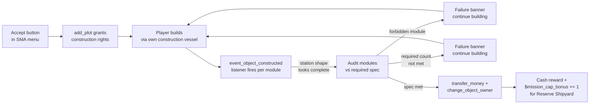

You can take on **build contracts** from factions to construct specific station types, tightly specified, on their behalf. Each mission has a spec you must meet exactly (only the listed module classes are allowed, forbidden ones make the station unacceptable). On successful validation, the mod transfers ownership to the requesting faction and pays out cash — plus, for the Reserve Shipyard mission, permanently raises that faction's hero cap.

This is where the player becomes an economic actor in the mod: their construction skills grow a faction's infrastructure, and their reward is cash + institutional weight (more heroes for that faction). No auto-generation, no jobs system — you build it by hand.

## Missions currently shipping

| Mission | Trigger | Reward | Effect |
|---|---|---|---|
| **Trade Hub** | Resource Conglomerate submenu → "Build Trade Hub" button (visible when the conglomerate has a member sector without a tradestation) | `min(station.value × 1.5, 15 M cr)` | New tradestation in the conglomerate's sector, transferred to sector controller. Conglomerate gets one active tradestation and one economic hub. |
| **Reserve Shipyard** | Faction Missions submenu → per-faction row → Accept | `min(station.value × 1.5, 100 M cr)` | New shipyard in a distant faction sector, plus **+1 hero cap for that faction** permanently. Faction can now spawn one more admiral / coordinator / engineer than before. |

Both missions use the same pattern: custom mission framework (not vanilla GM_BuildStation, because vanilla can't enforce strict module exclusion), `add_plot` for the plot grant, `event_object_constructed` listener for validation.

Two more designed but not shipped: Fleet Academy (habitation-heavy, hire specialists), Researchers Guild (unlock corp archetype for the faction). Both deferred.

## Trade Hub — the small mission

### When it appears

Open the SMA menu → **Resource Conglomerates** → pick a conglomerate → detail page shows all its member sectors. If **any** member sector lacks a tradestation owned by that sector's controller (not Xenon / Kha'ak / player), a **"Build Trade Hub"** button appears at the top.

Only **1 active Trade Hub mission per conglomerate** at a time — the button hides while a mission is active or after the station is built.

### Required module spec

The validated station must contain **exactly**:

| Class / type | Count | Notes |
|---|---|---|
| M dockarea (`class.dockarea`) | ≥ 2 | Any race's macro |
| L pier (`class.pier`) | ≥ 2 | Any race's L pier (capital docking) |
| L solid cargo storage (`class.storage`, capacity.solid > 0) | ≥ 2 | L, but M works — economically inefficient |
| L container cargo storage (`class.storage`, capacity.container > 0) | ≥ 2 | Same |
| L liquid cargo storage (`class.storage`, capacity.liquid > 0) | ≥ 2 | Same |

**Forbidden modules** (any occurrence fails validation):

- `class.productionmodule`
- `class.buildmodule`
- `class.headquarters`

**Allowed but not validated** (any number OK):

- `class.connectionmodule` (structural)
- `class.habitation`
- `class.defencemodule` (turret platforms — useful for hub protection)

### Cash reward

`min(station.value × 1.5, 15 M cr)` — vanilla-standard ×1.5 multiplier, capped at 15 M.

Practical implication: the cap kicks in once the station value is ≥ 10 M cr. Extra investment beyond that point doesn't raise the reward — you'll want to hit the spec efficiently, not maximally.

### Lifecycle

1. **Accept** — button click → mission created → `add_plot` grants you construction rights in the conglomerate's chosen member sector, plot size ~5 km cube at sector core
2. **Build** — use your own construction vessel (vanilla mechanic). Every module you place is your own until validation
3. **Trigger validation** — `event_object_constructed` fires when your station finishes each module. When the mod detects a "complete" station shape, it audits the modules
4. **Success case** — module count matches spec + no forbidden modules present → cash transfers to you, station transfers to sector controller
5. **Failure case** — forbidden module present, OR required count not met → banner "Extra: Production module (need 0, have 1)" — you must demolish the extra before validation passes
6. **Cancel** — the mission stays accepted until you either validate or manually cancel via menu. No timeout.

## Reserve Shipyard — the big mission

### When it appears

Open the SMA menu → **Faction Missions** → per-faction row → **"Reserve Shipyard"** row + Accept button.

Eligibility (locked 2026-06-02):

- Faction must have **≥3 active heroes** of any archetype in `$active_heroes`
- Faction must have **≥2 sector hops** to any of its existing shipyards or wharves (the shipyard must go somewhere the faction can't easily reach with current infrastructure — reserve reinforcement)
- Only **1 active per faction** at a time

The mission text describes what shipyard the faction wants and where. The plot grant lands on the chosen sector core.

### Required module spec

The validated station must contain:

| Class / type | Count | Notes |
|---|---|---|
| L container storage | ≥ 5 | High-throughput ship-parts storage |
| XL build module (`class.buildmodule`, `canbuildclass.{class.ship_xl}`) | ≥ 2 | Capital ship yards |
| L build module (`canbuildclass.{class.ship_l}`) | ≥ 2 | Destroyer yards. Note: XL build modules typically also satisfy L, so 2× XL + 2× L can double-count as 4× L or as 2× XL + 2× L; either shape validates |
| S/M build module (`canbuildclass.{class.ship_s}` OR `.ship_m`) | ≥ 2 | Wharf-type |
| L pier | ≥ 2 | |
| M dockarea | ≥ 2 | |
| L habitation (any `class.habitation`, `_l_` in macro name) | ≥ 4 | Crew barracks |

**Forbidden modules: none.** Vanilla shipyards traditionally include production + admin modules, so the mission is relaxed — you can build a proper faction shipyard with all its ancillary support.

**Allowed but not validated:**

- `class.connectionmodule`
- `class.defencemodule`

### Cash + institutional reward

Cash: `min(station.value × 1.5, 100 M cr)` — 100 M cap (vs Trade Hub's 15 M cap).

**Institutional reward:** `+1` to per-faction `$mission_cap_bonus.{$faction}`. This is added to `MlogHeroesComputeFactionSlots` total, meaning **the faction permanently gets one more active hero slot**. If the faction had 3 admiral slots before, they have 4 after — and HeroManager will spawn a new lineage next tick.

Consequences of raising the cap:
- Faction fields more admirals / coordinators / engineers than before
- Faction's decision surface at HeroManager increases (more independent decisions per tick)
- Long-term game state: the faction is measurably stronger militarily + strategically

## Sector eligibility check

For Reserve Shipyard, the mod picks an **eligible sector** by:

1. Enumerate all sectors owned by the target faction
2. For each candidate, `find_sector_in_range object=$candidate maxdistance=3 multiple=true`
3. For each sector in that range, `find_station_by_true_owner faction=$faction shipyard=true OR wharf=true space=$nearby` → if ANY exists, `$candidate` is ineligible
4. Pick the first eligible candidate (or sort by ownership area / yield — implementation-specific)

**Edge case:** if the faction has no shipyards or wharves at all, every sector is eligible (constraint is vacuously true).

## Mission workflow (both types)

## Design intent

- **Player as economic actor.** These missions turn the player from a passive observer of faction economy into an active builder-for-hire.
- **Strict specs.** Missions require exact shapes — no "build anything, get paid for anything". Discipline pays off.
- **Reserve Shipyard is deliberately expensive.** The 100 M cap is high, and the cap-raise is a **permanent institutional change** to the faction. The player's investment in a faction manifests in a durable way.
- **No auto-generation.** These missions don't auto-appear as pop-ups. The player has to browse menus to find them. Discovery is part of the gameplay.

## What's next

- **Fleet Academy** _(concept, deferred)_ — habitation-heavy station in a Coordinator faction sector. Reward: +1 hero cap **and** ability to hire advanced specialists (pilot lvl3, engineer lvl3, boarder, manager) from the station.
- **Researchers Guild** _(concept, deferred)_ — unlocks corp archetype (Researchers Guild = trader guild's science counterpart) for the faction. Ship spec TBD.
- **Mission chains** _(design open)_ — Trade Hub → Reserve Shipyard for the same conglomerate as a two-part campaign.

## Related mechanics

- [Perks system](../perks/) — cash rewards feed hero cash → LEARN progression
- [Coordinator archetype](../../archetypes/coordinator/) — the Reserve Shipyard mission ties institutionally to Coordinators (they benefit most from the +1 cap since larger factions have Coordinators)
- [Satellite Sale to Factions](../satellite-sale/) — another player-driven revenue path
