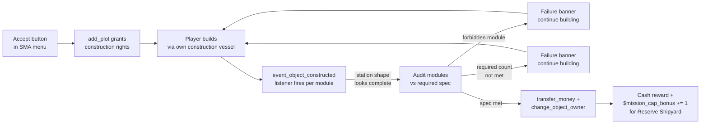

**Status: this feature is not in the mod you can install.** The in-game screen is a placeholder, and the menu registrations that led to it were removed from the release. Everything below describes a design that was built and then held back — it is documented because the specs are worth keeping, not because you can play it.

## What was removed, and what survived

The release strip in build **mlog670** removed the Options-menu registrations for six screens at once: Resource Conglomerates, Energy Zones, Trade Hubs, Faction Missions, Faction Reserves and Small Corporations. The implementations were preserved on a feature branch and a tag rather than deleted, so restoring them is a cherry-pick and not a rewrite.

What that means in practice:

| | |
|---|---|
| **In the shipped mod** | One menu row reading *"Faction missions — coming in a future iteration."* |
| **Not shipped** | Both missions, their validators, their plot grants and their rewards |
| **Still true** | The `$mission_cap_bonus` hook the Reserve Shipyard fed still exists in the hero-slot arithmetic — with nothing able to increment it |

That last row is the honest oddity. The **+1 hero cap** reward is still wired into the slot calculation; it simply has no source any more. A faction's cap today is base + territory + leadership, and the mission term is permanently zero.

## The design

You take on **build contracts** from factions to construct specific station types, tightly specified, on their behalf. Each mission has a spec you must meet exactly — only the listed module classes are allowed, and a forbidden one makes the station unacceptable. On successful validation, the mod transfers ownership to the requesting faction and pays out cash.

This is the one place the design made the player an **economic actor** rather than an observer: your construction skills grow a faction's infrastructure, and your reward is cash plus institutional weight. No auto-generation and no jobs system — you build it by hand.

| Mission | Reward | Effect |
|---|---|---|
| **Trade Hub** | `min(station.value × 1.5, 15 M cr)` | New tradestation in a Resource Conglomerate member sector, transferred to the sector controller. |
| **Reserve Shipyard** | `min(station.value × 1.5, 100 M cr)` | New shipyard in a distant faction sector, plus **+1 hero cap for that faction**, permanently. |

Both used the same pattern: a custom mission framework rather than vanilla `GM_BuildStation` — because vanilla cannot enforce strict module exclusion — `add_plot` for the plot grant, and an `event_object_constructed` listener for validation.

Two more were designed and never built: **Fleet Academy** (habitation-heavy, hires specialists) and **Researchers Guild** (unlocks a corp archetype for the faction).

## Trade Hub — the small mission

### Where it was reached

The Resource Conglomerates screen → a conglomerate → its member sectors. If **any** member sector lacked a tradestation owned by that sector's controller (not Xenon, Kha'ak or player), a **Build Trade Hub** button appeared.

Only **one active Trade Hub mission per conglomerate** — the button hid while a mission ran, and after the station was built.

### Required module spec

The validated station had to contain **exactly**:

| Class / type | Count | Notes |
|---|---|---|
| M dockarea (`class.dockarea`) | ≥ 2 | Any race's macro |
| L pier (`class.pier`) | ≥ 2 | Any race's L pier (capital docking) |
| L solid cargo storage (`class.storage`, capacity.solid > 0) | ≥ 2 | L, but M works — economically inefficient |
| L container cargo storage (`class.storage`, capacity.container > 0) | ≥ 2 | Same |
| L liquid cargo storage (`class.storage`, capacity.liquid > 0) | ≥ 2 | Same |

**Forbidden modules** — any occurrence fails validation:

- `class.productionmodule`
- `class.buildmodule`
- `class.headquarters`

**Allowed but not validated**, any number:

- `class.connectionmodule` (structural)
- `class.habitation`
- `class.defencemodule` (turret platforms — useful for hub protection)

### Cash reward

`min(station.value × 1.5, 15 M cr)` — the vanilla-standard ×1.5 multiplier, capped at 15 M.

The cap bites once the station is worth 10 M cr or more, so investment past that point raises nothing. The mission rewarded hitting the spec **efficiently, not maximally.**

### Lifecycle

1. **Accept** — the button creates the mission; `add_plot` grants construction rights in the chosen member sector, a plot roughly 5 km cube at the sector core.
2. **Build** — with your own construction vessel, the vanilla way. Every module is yours until validation.
3. **Validate** — `event_object_constructed` fires per module; when the station looks complete the mod audits it.
4. **Success** — counts match and no forbidden module is present: cash transfers to you, the station to the sector controller.
5. **Failure** — a banner names the problem, e.g. *"Extra: Production module (need 0, have 1)"*. You demolish and it re-audits.
6. **Cancel** — the mission stays accepted until you validate or cancel. No timeout.

## Reserve Shipyard — the big mission

### Where it was reached

The Faction Missions screen → a per-faction row → **Accept**. Eligibility:

- The faction has **≥ 3 active heroes** of any archetype.
- The target sector is **≥ 2 sector hops** from any of the faction's existing shipyards or wharves — the point is reinforcement where the faction is thin.
- **One active per faction** at a time.

### Required module spec

| Class / type | Count | Notes |
|---|---|---|
| L container storage | ≥ 5 | High-throughput ship-parts storage |
| XL build module (`class.buildmodule`, `canbuildclass.{class.ship_xl}`) | ≥ 2 | Capital ship yards |
| L build module (`canbuildclass.{class.ship_l}`) | ≥ 2 | Destroyer yards. XL build modules usually satisfy L too, so 2×XL + 2×L validates either way |
| S/M build module (`canbuildclass.{class.ship_s}` or `.ship_m`) | ≥ 2 | Wharf-type |
| L pier | ≥ 2 | |
| M dockarea | ≥ 2 | |
| L habitation (`class.habitation`, `_l_` in the macro name) | ≥ 4 | Crew barracks |

**Forbidden modules: none.** Vanilla shipyards carry production and admin modules, so the spec stayed relaxed — you could build a proper faction shipyard with all its support.

### Cash and institutional reward

Cash: `min(station.value × 1.5, 100 M cr)`.

The institutional half was `+1` to that faction's `$mission_cap_bonus`, added into the hero-slot total. A faction with 3 slots would have 4, and the hero manager would spawn a new lineage on the next tick — a faction measurably stronger, permanently, because of something the player built.

### Picking the sector

1. Enumerate every sector the target faction owns.
2. For each candidate, search within 3 sectors.
3. If any shipyard or wharf of that faction is found in range, the candidate is out.
4. Take the first survivor.

**Edge case:** a faction with no shipyards or wharves at all makes every sector eligible, because the constraint is vacuously true.

## Mission workflow (both types)

```mermaid
flowchart LR
  Accept["Accept button<br/>in SMA menu"] --> Grant[add_plot grants<br/>construction rights]
  Grant --> Build["Player builds<br/>via own construction vessel"]
  Build --> Listen[event_object_constructed<br/>listener fires per module]
  Listen -->|station shape<br/>looks complete| Audit[Audit modules<br/>vs required spec]
  Audit -->|forbidden module| Fail1[Failure banner<br/>continue building]
  Audit -->|required count<br/>not met| Fail2[Failure banner<br/>continue building]
  Audit -->|spec met| Success[transfer_money +<br/>change_object_owner]
  Success --> Reward[Cash reward + <br/>$mission_cap_bonus += 1<br/>for Reserve Shipyard]
  Fail1 --> Build
  Fail2 --> Build
```

## Design intent

- **Player as economic actor.** The player stops observing the faction economy and starts building it.
- **Strict specs.** No "build anything, get paid for anything" — discipline is the gameplay.
- **Reserve Shipyard is deliberately expensive.** A 100 M cap and a permanent institutional change to a faction; the investment shows up durably.
- **No auto-generation.** Nothing pops up. You find these by browsing, and discovery is part of it.

## Honest list

- **None of this is playable in the current build.** The menu row is a placeholder and says so.
- **Why it was held back is not documented in the code**, only that it happened in the release strip. Treat the specs above as a design of record, not a promise of a date.
- **The reward hook is still live and unreachable.** `$mission_cap_bonus` is read by the slot arithmetic and written by nothing.
- **Five sibling screens went with it** — Resource Conglomerates, Energy Zones, Trade Hubs, Faction Reserves and Small Corporations. Anything you read elsewhere that assumes those screens exist is describing the same held-back branch.

## Related mechanics

- [Perks](../perks/) — cash rewards feed hero cash, which feeds LEARN progression
- [Coordinator](../../archetypes/coordinator/) — the faction sizes that would have gained most from a +1 cap
- [Satellite sale to factions](../satellite-sale/) — a player-driven revenue path that **is** in the release
