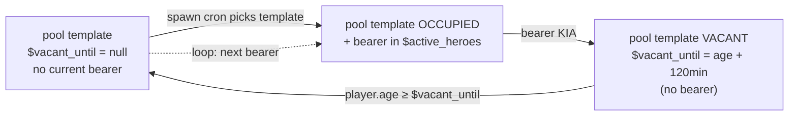

Heroes die for real (see [Death cycle](../death-cycle/)) — but factions don't lose the *role* forever. Every hero belongs to a **lineage** — a template that keeps producing bearers over time, each with their own name, face, and career. When one bearer dies, the lineage waits, then produces a successor.

## Pool templates, not one-off characters

`deploy/md/mlog_heroes_data.xml` stores heroes as **pool templates**, not concrete personalities. Each template looks like this:

```
{
  $pool_id          = 'arg_admiral_korkov_lineage',
  $faction          = faction.argon,
  $archetype        = 'admiral',
  $bio_template     = '<in-universe backstory text>',
  $names_pool       = ['Walter Korkov', 'Hadrian Voss', ...],
  $faces_pool       = [<character_macro_1>, ...],
  $home_sector      = sector.argonprime,
  $vacant_until     = null,   // set after KIA
}
```

The **role** (Argon admiral of the Korkov lineage) is persistent. The **bearer** (the specific Walter Korkov you know) is not.

## Bearer lifecycle



**When a bearer is KIA'd:**

1. The bearer's full record moves to `$kia_heroes` archive — permanent memorial with final XP, ★, kill count, last kill, face, cause of death, `$kia_at`.
2. The pool template gets `$vacant_until = player.age + $succession_cooldown_min` (default 120 game-minutes).
3. Every HeroManager tick, the mod checks templates. When `player.age ≥ $vacant_until`, the template is available again.
4. If HeroManager needs a hero for the faction, the template is picked and a **new bearer** spawns:
   - Fresh `$display_name` picked from `$names_pool` (excluding the KIA'd name for one cycle to prevent immediate repeat)
   - Fresh face from `$faces_pool`
   - `$xp = 0`, `$stars = 1`, `$recovery_points = 0`
   - **Full starting fleet granted immediately** (bypasses the RP system for first spawn; see [Recovery Points](../recovery-points/))
   - `$bio_template` copied literally to the new bearer (v0.1 — full parametric bio composition is future work)

## KIA archive

`md.mlog_heroes.MlogHeroesInit.$kia_heroes` is an **append-only table**, keyed by `<pool_id>_<sequence>` (e.g. `arg_admiral_korkov_lineage_001`).

Every record:

```
{
  $pool_id, $display_name, $archetype, $faction,
  $final_xp, $final_stars, $final_kill_count, $last_kill,
  $kia_at = player.age,
  $face = <character_macro>,
  $cause = 'flagship_destroyed',  // future: 'boarded', 'old_age', etc.
}
```

Archived records **never come back to `$active_heroes`**. The dead stay dead. The successor is a different person, not a resurrection.

The archive supports:

- **Memorial UI** _(planned)_ — a "legends of the faction" page listing every dead hero of a faction, sortable by rank / kill count / death date.
- **Lineage genealogy** _(future)_ — display the N-th bearer of the same lineage, so a player can see "you are hunting the third Buccaneer captain to bear this name; the second was killed by an unknown Argon patrol in 843".
- **Mission hooks** _(future, see concept C-005)_ — revenge missions, relics tied to specific dead heroes, faction news mentioning their deaths.


The Retired archive is a separate track — heroes mustered out by faction succession events (e.g. faction merger, planned future feature):


## What the player sees

**Immediately on KIA:**

- Notification banner names the dead hero and their outcome
- The hero disappears from the [roster](../../#in-game-menu-tour)
- The archive gets the new record (accessible once the memorial UI ships)

**Between KIA and successor spawn (120 min):**

- The lineage is not visible in the roster
- The faction has one fewer hero for the duration
- If the faction has other admirals, they carry the strategic load

**When the successor spawns:**

- New yellow marker appears in the faction's home sector
- Menu shows the new hero with the same bio flavour and archetype
- Roster row will look nearly identical to the old bearer's — same faction, same archetype, different name and face

The player experience is: **"The Korkov lineage lives on. New face, same responsibility."**

## Pool exhaustion

Every template can spawn many bearers over time (one at a time). But if:

- All faction templates are `occupied` or `vacant`, and
- HeroManager has no available role to fill,

the faction may temporarily go without an active hero of a specific archetype. This is not a bug — it is faction rebalancing under attrition. The next available template picks up when it cycles back.

If **all** templates for a faction are exhausted for a long period, the mod does not synthesize new lineages on the fly. The faction rides out the drought until vacancies clear. Result: heavy war losses can noticeably weaken a faction's hero presence for hours of game time.

## Design intent

- **Persistence of role, not persistence of character.** Factions have continuity; individuals do not.
- **Memorable losses.** When a favourite hero is KIA'd, the successor is a different person with a different face and story. The loss stays a loss.
- **No resurrection.** No mechanism brings a dead bearer back — this preserves the meaning of every KIA.
- **Lineage as archive.** The KIA record is the memorial. Long game saves accumulate a rich list of "who this lineage has been over time".

## Related mechanics

- [Death cycle](../death-cycle/) — the d100 roll that decides when this flow triggers
- [Recovery Points](../recovery-points/) — why successors get a full starting fleet grant (instead of rebuilding from 0 RP)
- [XP and star progression](../xp-and-stars/) — why the successor starts at ★ with 0 XP rather than inheriting anything from the predecessor
