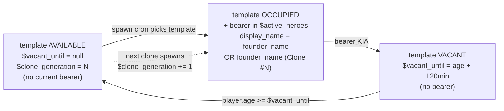

Heroes die for real (see [Death cycle](../death-cycle/)) — but factions don't lose the *role* forever. Every hero belongs to a **lineage** — a template with a **founder identity**. When the current bearer dies, the lineage waits, then produces a **clone** of the founder with the same name + a `(Clone #N)` suffix, a fresh XP counter, and the **perks the previous bearer had unlocked**.

The clone system replaces the earlier "new face, new name from pool" model. Two reasons: (1) authoring name pools per faction × archetype is content the mod doesn't ship; (2) sci-fi clone lore does the emotional work for free — the name "Korkov" keeps coming back, and every KIA on the wall reads as a chapter in the same story.

## The founder

Each pool template has one **founder**:

```
$arg_admiral_001 = table[
  $template_id     = 'arg_admiral_001',
  $founder_name    = 'Captain Sarah Kowalski',
  $bio_template    = '<in-universe backstory>',
  $faction         = faction.argon,
  $archetype       = 'admiral',
  $home_sector     = sector.argonprime,
  $perks           = [...],       // authored perk list
  $vacant_until    = null,        // set after KIA
  $clone_generation = 0,          // counter, per-template
]
```

When the mod first spawns a bearer for this template, that bearer is the **founder**. Their registry entry gets:

```
$active_heroes.{arg_admiral_001} = table[
  $display_name     = 'Captain Sarah Kowalski',   // same as founder
  $is_clone         = false,
  $clone_generation = 0,
  $xp = 0, $stars = 1, $recovery_points = 0,
  $perks_state = <initialized from template.$perks>,
  ...
]
```

## Bearer lifecycle



**When a bearer is KIA'd:**

1. The bearer's full record moves to `$kia_heroes` archive — permanent memorial with `$display_name` (with clone suffix if any), final XP, ★, kill count, last kill, face, cause of death, `$kia_at`, `$is_clone`, `$clone_generation`.
2. The pool template gets `$vacant_until = player.age + $succession_cooldown_min` (default 120 game-minutes).
3. Every HeroManager tick, the mod checks templates. When `player.age >= $vacant_until`, the template is available again.
4. If HeroManager needs a hero for the faction, the template is picked and a **clone** spawns:
   - Reads `$pool_state.{template}.$clone_generation`, increments to N
   - `$display_name = $founder_name + ' (Clone #' + N + ')'` → e.g. `Captain Sarah Kowalski (Clone #1)`
   - Fresh face from the vanilla NPC generator (no per-template face pool — the clone looks Argon-generic)
   - `$xp = 0`, `$stars = 1`, `$recovery_points = 0`
   - **Full starting fleet granted immediately** (bypasses the RP system for first spawn; see [Recovery Points](../recovery-points/))
   - `$bio_template` copied literally to the clone
   - **`$perks_state` INHERITED from the KIA'd bearer's perks_state at moment of death** — active perks stay active, LEARNed perks stay learned, locked perks stay locked with their original conditions. **This is the important part** — see below.

## Perks inheritance across clones

The clone inherits the **perks state**, not the XP. This is deliberate:

- The **XP** is the bearer's individual combat record. A new clone hasn't earned it — they start at 0.
- The **perks** are the **lineage's accumulated reputation**. Sarah Kowalski (original) unlocked Master Logistic through the 10M cr milestone; if she dies, Sarah Kowalski (Clone #1) inherits Master Logistic because the lineage — as an institution the faction invests in — retains that reputation.

Consequence: if the player has been actively building up a lineage's perks (via gifts to raise the hero's cash / by picking up cheap ★★★ tier upgrades through LEARN), that investment survives even repeated KIAs of the current bearer.

Perks the clone inherits fall into these categories:

- **Active (unlocked from the original bearer)** — apply immediately on spawn (e.g. RP tick x1.5 from Logistic starts on tick 1)
- **Locked (never unlocked in original)** — remain locked with their original condition, same as if they'd been authored fresh
- **Locked-behind-cash-milestone** — remain locked, cash counter carries over

**What the clone does NOT inherit:** the flagship, the escort roster, the kill count, the last-kill record, and — importantly — the RP reservoir. Every clone is a full "start from ★" bearer for their own combat record, but stands on the shoulders of the lineage's LEARNed perks.

## KIA archive

`md.mlog_heroes.MlogHeroesInit.$kia_heroes` is an **append-only table**, keyed by `<pool_id>_<sequence>` (e.g. `arg_admiral_001_1`, `arg_admiral_001_2`, `arg_admiral_001_3` for successive clones of the same lineage).

Every record:

```
{
  $pool_id, $display_name (with any clone suffix), $archetype, $faction,
  $final_xp, $final_stars, $final_kill_count, $last_kill,
  $kia_at = player.age,
  $face = <character_macro>,
  $cause = 'flagship_destroyed',
  $is_clone, $clone_generation,
}
```

Archived records **never come back to `$active_heroes`**. The dead stay dead. The next clone is a different individual (fresh XP, different combat record), even though they share the founder's name and inherited the lineage perks.

The archive supports:

- **Memorial UI** — the KIA archive submenu ("no fallen heroes — all bearers still alive or in active recovery" is the empty state). Every dead hero listed with final stats.
- **Lineage genealogy** _(future)_ — grouping records by template so you can browse "Sarah Kowalski (founder)", "Sarah Kowalski (Clone #1)", "Sarah Kowalski (Clone #2)" as a lineage history.
- **Mission hooks** _(future, see concept C-005)_ — revenge missions, relics tied to specific dead bearers, faction news mentioning their deaths.


The Retired archive is a separate track — heroes mustered out by faction succession events (e.g. faction merger, planned future feature):


## Configurable succession cooldown

`$succession_cooldown_min` in `MlogHeroesInit` actions controls how long a template stays vacant after KIA. Default: **120 game-minutes** (2 game-hours).

| Value | Feel |
|---|---|
| 30 | Fast churn — clones appear within game-half-hour; a faction rarely goes without an admiral of a specific lineage |
| **120 (default)** | Balanced — the faction is noticeably weaker for ~2 game-hours after a big loss |
| 240 | Grimdark — a KIA'd lineage stays vacant for a game-work-shift, faction feels the loss |

## What the player sees

**Immediately on KIA:**

- Notification banner names the dead hero and their outcome
- The hero disappears from the [roster](../../#in-game-menu-tour)
- The KIA archive gets the new record

**Between KIA and clone spawn (120 min):**

- The lineage is not visible in the roster
- The faction has one fewer active hero for the duration
- Other heroes of the same faction carry the strategic load

**When the clone spawns:**

- New yellow marker appears in the faction's home sector
- Roster row will look nearly identical to the previous bearer's — same faction, same archetype, same name + `(Clone #N)` suffix
- Perks already-unlocked show as active immediately
- Fresh XP, ★1, empty kill count — a new individual with the lineage's inherited reputation

Player experience: **"The Korkov lineage lives on. Same name, same institutional weight. New tally, same responsibility."**

## Pool exhaustion

Every template can spawn many clones over time (one at a time; `$clone_generation` counter has no cap). If:

- All faction templates are `occupied` or `vacant`, and
- HeroManager has no available role to fill,

the faction may temporarily go without an active hero of a specific archetype. This is not a bug — it is faction rebalancing under attrition. The next available template picks up when its `$vacant_until` expires.

If **all** templates for a faction are exhausted for a long period (mass KIA event across multiple lineages), the faction rides out the drought until vacancies clear. Result: heavy war losses can noticeably weaken a faction's hero presence for hours of game time.

## Design intent

- **Persistence of role, not persistence of body.** Factions have continuity through the lineage template + inherited perks; individual clones are combat-record-tracked but ephemeral.
- **Memorable losses.** When a favourite hero is KIA'd, the clone arrives with a fresh combat record — the loss stays a loss. The XP and kill count of the previous bearer are archived forever.
- **No resurrection.** No mechanism brings a dead bearer back — the clone is a new individual, not a revival. The `$clone_generation` counter makes this literal.
- **Lineage-as-archive.** The KIA archive accumulates a rich history over a long save — a lineage might have 6+ archived clones by mid-game if the player has been actively engaging in dangerous ops.
- **Perk investment is protected.** Cash spent on gifts + LEARN cost is not lost when a bearer dies. This is the mechanical reason for players to care about a specific lineage across multiple bearers.

## Related mechanics

- [Death cycle](../death-cycle/) — the d100 roll that decides when this flow triggers
- [Recovery Points](../recovery-points/) — why clones get a full starting fleet grant (instead of rebuilding from 0 RP)
- [XP and star progression](../xp-and-stars/) — why the clone starts at ★1 with 0 XP rather than inheriting anything from the previous bearer
- [Perks system](../perks/) — how perks are unlocked, LEARNed, and inherited across clones
